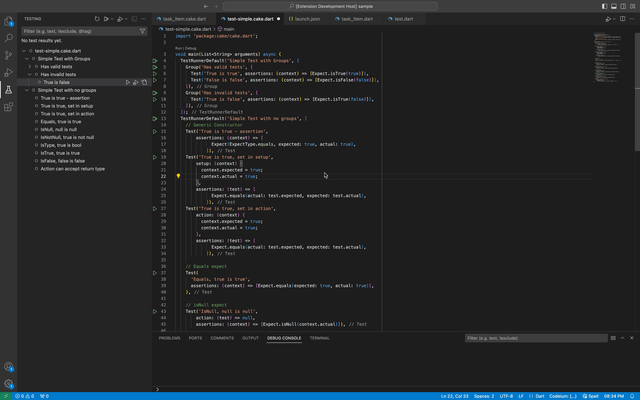

    
    <h1> Cake Test Runner for Visual Studio Code</h1>
    
Learn more about Cake, the lightweight, explicit testing framework for Dart/Flutter.

## Getting started

- Get the extension within VS Code, or download from the Open VSX Registry or Visual Studio Marketplace.
*Note: Cake Test Runner is compatible with VS Code version 1.68.1 and above.*

- Include Cake in your `pubspec.yaml` file or install by running `dart pub get cake`
- Open the Test Explorer in VS Code or open a Cake test file (any file ending with .cake.dart) to run.

## Requirements

- VS Code version 1.68.1 and above.
- Dart 2.17 and above.
- Cake v4.0 and above.

## Features

### Run or Debug Tests within Test Explorer or in code

You can run or debug files, Test Runners, Groups, or Tests directly from the code or in The Test Explorer in VS Code.

    

## Feedback

If you discover a bug or have a suggestion, please check Issues page. If someone has already submitted your bug/suggestion, please upvote so it can get better visibility.

## License
This extension is licensed under Mozilla Public License, 2.0.